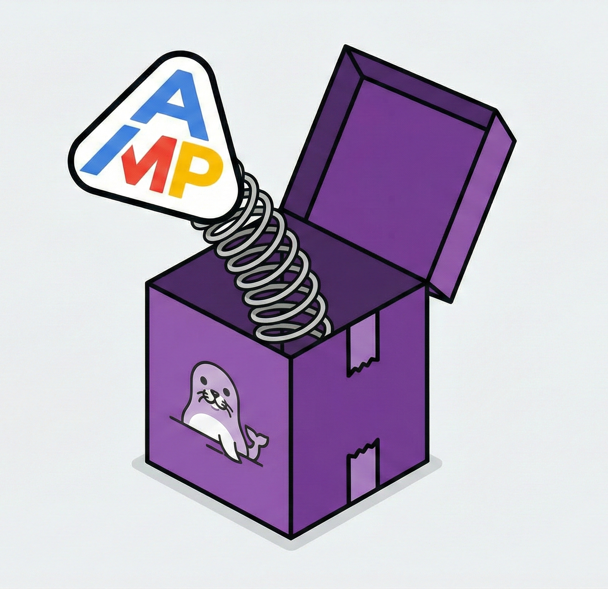

# Amp in a Box



A sandboxed, network-filtered environment for running [Amp CLI](https://ampcode.com) securely using Docker containers with a Squid proxy sidecar.

## Overview

Amp in a Box provides defense-in-depth security for running Amp CLI by:

- **Network isolation**: Amp runs in a container that can only access the internet through a filtering proxy
- **Domain allowlisting**: Only approved domains (Anthropic, GitHub, npm, etc.) are accessible
- **Domain blocklisting**: Additional domains can be explicitly blocked
- **Audit logging**: All network requests are logged through the Squid proxy

## Architecture

```
┌─────────────────────────────────────────────────────────┐
│                     Host System                          │
│  ┌───────────────────────────────────────────────────┐  │
│  │              Docker Network (Shared)               │  │
│  │  ┌─────────────────┐    ┌─────────────────────┐   │  │
│  │  │  Amp Container  │───▶│   Proxy Container   │   │  │
│  │  │                 │    │   (Squid Sidecar)   │   │  │
│  │  │  - Amp CLI      │    │                     │   │  │
│  │  │  - Your code    │    │  - Allowlist filter │   │  │
│  │  │  - Git, npm...  │    │  - Blocklist filter │   │  │
│  │  └─────────────────┘    │  - Access logging   │   │  │
│  │                         └──────────┬──────────┘   │  │
│  └────────────────────────────────────┼──────────────┘  │
│                                       │                  │
└───────────────────────────────────────┼──────────────────┘
                                        ▼
                                   Internet
                              (Filtered Access)
```

## Quick Start

### Prerequisites

- [Podman](https://podman.io/getting-started/installation) (or Docker with Podman compatibility)
- Amp CLI credentials (stored in `~/.config/amp/`)

### Installation

1. Clone this repository:
   ```bash
   git clone https://github.com/NickJLange/amp_in_a_box.git
   cd amp_in_a_box
   ```

2. Build the container images:
   ```bash
   make build
   ```

3. Review and customize the allowlist:
   ```bash
   cat allowlist.txt
   ```

4. Run Amp in the sandbox with your project:
   ```bash
   make run-isolated PROJECT=/path/to/your/project
   ```

### Using Pre-built Images

Pull from GitHub Container Registry instead of building locally:

```bash
make pull
make run-isolated PROJECT=/path/to/your/project
```

## Building Containers

### Build Commands

```bash
# Build both amp and proxy containers
make build

# Build only the amp container
make build-amp

# Build only the proxy sidecar
make build-proxy
```

### Push to Registry

```bash
# Push both images to ghcr.io
make push-all

# Push with a specific tag
make push-all TAG=v1.0.0

# Push to a different namespace
make push-all NAMESPACE=myorg TAG=v1.0.0
```

## Running Amp

### PROJECT Variable (Required)

The `PROJECT` variable specifies which directory to mount inside the container at `/worktree`. This is the directory Amp will work in.

```bash
# Run with network filtering (recommended)
make run-isolated PROJECT=/home/user/myproject

# Run without network filtering (direct access)
make run
```

### What Gets Mounted

| Host Path | Container Path | Access |
|-----------|---------------|--------|
| `$PROJECT` | `/worktree` | read-write |
| `~/.config/amp` | `/home/amp/.config/amp` | read-write |
| `~/.local/share/amp` | `/home/amp/.local/share/amp` | read-write |
| `~/.cache/amp` | `/home/amp/.cache/amp` | read-write |
| `~/.gitconfig` | `/home/amp/.gitconfig` | read-only |
| `~/.ssh` | `/home/amp/.ssh` | read-only |

### Examples

```bash
# Work on a project in your home directory
make run-isolated PROJECT=~/projects/my-app

# Work on a project in a custom location
make run-isolated PROJECT=/data/repos/my-service

# Stop running containers
make stop

# Clean up containers and images
make clean
```

## Configuration

### allowlist.txt

Domains that Amp is allowed to access. Includes wildcards with `.` prefix:

```
ampcode.com
.ampcode.com
anthropic.com
.anthropic.com
github.com
.github.com
# ... etc
```

### blocklist.txt

Additional domains to explicitly block (even if they match allowlist patterns):

```
# Lines starting with # are comments
.malware-site.com
.tracking-domain.net
```

### envfile

Environment variables passed to the Amp container:

```bash
AMP_API_KEY=your-key
# Additional environment configuration
```

## Security Model

| Layer | Protection |
|-------|------------|
| Container isolation | Amp runs in a separate container with limited host access |
| Network namespace | Amp container shares network with proxy sidecar only |
| Proxy filtering | All HTTP/HTTPS traffic filtered through Squid |
| Domain allowlist | Only pre-approved domains are accessible |
| Domain blocklist | Explicit deny rules for known-bad domains |
| Audit logging | All network requests logged for review |

## Logs

Proxy access logs are written to `~/.local/log/amp-proxy/` and show all network requests:

```
TCP_TUNNEL/200 - Allowed HTTPS connection
TCP_DENIED/403 - Blocked request (not on allowlist)
```

## Customization

### Adding allowed domains

Edit `allowlist.txt` and add the domain:
```
newdomain.com
.newdomain.com  # includes all subdomains
```

### Blocking specific domains

Edit `blocklist.txt`:
```
.unwanted-domain.com
```

## License

[MIT](LICENSE)

## Contributing

Contributions welcome. Please open an issue or pull request.
